# Savr — Business Logic & Data Model (v4)

> Language: the application is **English-only**.
> Notation used below for fields: `field` : type (constraints) — description.
> Types: `UUID`, `string`, `text`, `int`, `decimal`, `bool`, `timestamp`, `enum(...)`, `JSON`, `FK→Entity`.

### Changelog — v3 (decisions from the meeting)

| # | Change | Sections touched |
|---|--------|------------------|
| 1 | **Member registration is open to everyone.** A promo code is no longer required to sign up; it is now an *optional* attribution field. | §1, §2, §3.3, §4.5 |
| 2 | **Merchant & Influencer accounts are created manually by the Admin.** These roles have no public self-registration screen. | §2, §3.1, §3.2, §4.1 |
| 3 | **KYC (Know Your Customer)** — merchants and influencers now carry a `kyc_verified` flag plus uploaded KYC document **files**. | §3.1, §3.2, §4.1 (`KycDocument`) |
| 4 | **Social sign-in** — registration supports **Google** and **Apple** sign-in, but **phone (OTP) verification remains mandatory** as the next step of Gate 1. | §1, §3.3, §4.1 |
| 5 | **Subscription payments generate a payout.** A successful subscription payment accrues a **payout at a configurable percentage**, which the admin can view and adjust. | §3.5, §3.10, §4.8 (`PayoutRate`) |
| 6 | **Merchant marketplace/storefront** — merchants build their own in-app storefront with brand images and a landing video (Facebook/Twitter-style page). | §3.6, §4.3 (`MerchantStorefront`, `StorefrontMedia`) |
| 7 | **Promo codes are reusable, not one-shot.** A code stays redeemable by any number of members for as long as its influencer passes **all four check gates** (active, approved, KYC-verified, code active). No expiry, no usage limit. | §3.4, §4.5 (`PromoCode`, `PromoCodeRedemption`) |
| 8 | **Influencers get their code from their own dashboard** — generated on clearing the gates, shared as code / deep link / QR. | §2, §3.4 |
| 9 | **Only the admin sets the discount value** a code is worth. Versioned like `PayoutRate`; the influencer can read it but never write it. | §2, §3.4, §3.11, §4.5 (`PromoDiscount`) |
| 10 | **Events are removed entirely.** No `EventDetail`, `EventApplication`, `EventAttendance`, and no **Event Planner** role. `Product` is no longer an offer/event discriminator — **every Product is an offer**. | §1, §2, §3.7, §3.8, §4.2, §4.3, §4.6, §4.7 |
| 11 | **Post tracking & verified-post compensation are removed.** `InfluencerPostTracker` is gone, along with the `offer_post` / `event_post` accrual sources. Influencers earn from **subscriptions and signups**, not posts. | §2, §3.9, §4.5 |

### Changelog — v4 (roles, gateway, currency, redemption — all open questions resolved)

| # | Change | Sections touched |
|---|--------|------------------|
| 12 | **All open questions removed.** Every former §8 item is now a decided fact folded into the model below. | (all) |
| 13 | **Role hierarchy expanded to seven roles.** `Admin` becomes **Super Admin**, and three delegated staff roles are added — **Member Manager**, **Merchant Manager**, **Accountant Manager**. | §2, §3.11, §4.2 |
| 14 | **Merchants and influencers are also members.** Every merchant and influencer account carries the **full member capability set** (browse, subscribe, redeem, hold pass) on top of its own tools. | §2, §3 |
| 15 | **Redemption is merchant-confirmed at the venue.** The merchant holds/enters the **redemption code** to confirm an offer at their venue or any location — confirming redemptions is the merchant's task. | §3.8, §4.6 |
| 16 | **Per-influencer discount, Super-Admin-set.** Every influencer has their **own** discount value; **only the Super Admin** can set it. | §2, §3.4, §4.5 |
| 17 | **Payment gateway is Paymennt.** All payments (Phase 1: membership subscription only), on mobile and web, run through **[Paymennt](https://www.paymennt.com/)**. | §3.5, §3.10, §4.8 |
| 18 | **Single currency: AED.** The platform operates in **AED** only in Phase 1. | §3.5, §3.10, §4.4, §4.8 |
| 19 | **Google & Apple sign-in auto-link.** Social identities auto-link to a matching email account; the profile email/name are read from the Google/Apple callback. | §3.3, §4.1 |
| 20 | **Every successful subscription payment counts as a payout, surfaced to the Accountant.** Outbound payouts are **issued manually** (bank / service provider) and only **recorded on the ledger** — no gateway is used outbound. | §3.5, §3.10, §4.8 |

---

## 1. Overview

Savr is an **open membership platform** that connects **Members** with discounted **Offers** provided by **Merchants**. **Anyone can register as a member** — a promo code from an **Influencer (Lead Generator)** is optional and only serves to attribute the signup. Access is gated in two stages:

1. **Verification gate (Gate 1)** — a new member sees *nothing* in the app until identity is verified. Registration may start with **email + password**, **Google sign-in**, or **Apple sign-in**. Google/Apple sign-in satisfies the *email* requirement automatically, but **phone (OTP) verification is mandatory in every case** and is always the **next step** after the account is created. No route into the app skips the phone check.
2. **Subscription gate (Gate 2)** — after verification, members can *browse* all offers, but must pay the **subscription fee** before they can *redeem an offer*. A persistent banner reminds unsubscribed members of this. Once paid, the member receives an **Apple Wallet Pass** and **Google Wallet Pass** as their virtual membership.

**Money flows in** from member subscriptions, taken through the **[Paymennt](https://www.paymennt.com/) gateway** in **AED** — the platform's single currency in Phase 1. **Every successful subscription payment immediately accrues an outbound payout** — a configurable **percentage** of the payment. The **Accountant Manager** sees each inbound payment and its accrued payout and **issues the outbound payout manually** (bank transfer / service provider), recording it on the ledger; no gateway is used for outbound money. **Merchant and Influencer accounts are not self-service:** a **Super Admin** (or the relevant manager role) creates them manually and records their **KYC** verification — and both roles also carry the **full member capability set**. Membership itself is managed automatically (activated/expired by payment status); staff only deactivate an account for cause.

---

## 2. User Roles & Access

Savr has **seven roles**: one super-user, three delegated **manager** (staff) roles, and three end-user roles. **Managers are staff accounts created by the Super Admin.** Merchant and Influencer accounts additionally hold **every capability a Member has**.

| Role | How the account is created | Needs approval? | Core capabilities |
|------|---------------------------|-----------------|-------------------|
| **Super Admin** | (seeded) | — | **Full access to everything.** Creates all staff (manager) accounts, merchants & influencers; verifies KYC; **sets the payout percentage**; **sets each influencer's promo-code discount value (the only role that can)**; approves accounts; oversees payouts, balance & ledger; deactivates any account for cause. |
| **Member Manager** | **Created by Super Admin** | — | View and **manage all member user accounts** (search, view detail, status/verification, deactivate for cause). No financial or merchant/influencer administration. |
| **Merchant Manager** | **Created by Super Admin** | — | View and **manage merchant profiles only** — onboarding, KYC upload/verify, approval, storefront moderation. Does not touch members' or influencers' administration or the financial dials. |
| **Accountant Manager** | **Created by Super Admin** | — | **Monitor payments only.** See all **inbound** subscription payments and their accrued **payouts**; **issue outbound payouts manually** to a bank / service provider and **record them on the ledger**. Read-only elsewhere; cannot set the payout % or the discount. |
| **Merchant** | **Created by Super Admin / Merchant Manager (manual)** — no public signup | ✅ + **KYC** | Build & manage own **marketplace storefront** (brand images, landing video); create/list/manage own offers; view own reports; **confirm offer redemptions at the venue (holds the redemption code)**. **Plus the full Member capability set.** |
| **Influencer (Lead Generator)** | **Created by Super Admin (manual)** — no public signup | ✅ + **KYC** | **Retrieve their reusable promo code from their dashboard** (share link / QR) and track redemptions; view own compensation & payout status; see **their own Super-Admin-set discount value** (cannot set it). **Plus the full Member capability set.** |
| **Member** | **Open self-registration** (email+password, **Google**, or **Apple** — social **auto-links**) | ❌ Automatic | Sign up freely (promo code optional); verify phone (**mandatory**) + email; **subscribe via Paymennt (AED)**; browse; redeem offers (**confirmed by the merchant**); hold Apple/Google Pass. |

**Members, merchants and influencers all share the member experience.** A merchant or influencer can browse, subscribe, and redeem exactly like a member; their extra tools sit on top. The `UserRole` junction (§4.2) carries the one-or-more roles a user holds. The Event Planner role remains **removed** along with events (see the changelog). **Member tiers:** Tier 1 & Tier 2 are *under development*. **Tier 3 is the only tier live in Phase 1**.

---

## 3. Business Process Flows

### 3.1 Influencer onboarding *(manual — admin-provisioned)*
**There is no public influencer registration screen.** Influencers are onboarded off-platform (contract, intro call) and the account is then **created manually by the Super Admin**:

The **Super Admin** opens *Admin → Influencers → Create* → enters the influencer's email, phone, and profile details → the account is created with `created_by_admin = true` and `approval_status = pending` → **uploads the influencer's KYC documents** (ID, proof of address, bank/payout details) → sets **`kyc_verified = true`** → **approves** the account → an invite/credential email is sent and the influencer sets their own password. The new influencer also receives the **full member capability set**.

**KYC is a hard gate on money out:** an influencer's promo code goes live once approved, but **no payout can be authorized while `kyc_verified = false`**. If rejected/deactivated, they lose all influencer capabilities.

### 3.2 Merchant onboarding *(manual — admin-provisioned)*
**There is no public merchant registration screen.** Same manual flow as the influencer:

The **Super Admin or Merchant Manager** opens *Admin → Merchants → Create* → enters business details (business name, category, registration number, address) → account created with `created_by_admin = true`, `approval_status = pending` → **uploads the merchant's KYC documents** (business licence, trade registration, owner ID) → sets **`kyc_verified = true`** → **approves** → the merchant dashboard unlocks: they can build their **marketplace storefront** (§3.6), create offers, view reports, **confirm redemptions at the venue**, and use all **member** features.

No money is paid to or collected from merchants in Phase 1 — KYC is collected for compliance and identity assurance, not for payouts.

### 3.3 Member onboarding & verification — Gate 1 *(open registration)*

**Registration is open to everyone.** No promo code is required to create an account. The registration screen offers three entry paths:

| Path | What it establishes | Email verification |
|------|--------------------|--------------------|
| **Email + password** | email, password | Verification email sent — must be confirmed |
| **Continue with Google** | email (already verified by Google), name, `provider_user_id` | ✅ Satisfied automatically — `email_verified_at` set at signup |
| **Continue with Apple** | email (or Apple private relay), name, `provider_user_id` | ✅ Satisfied automatically — `email_verified_at` set at signup |

**Technical note — phone verification is mandatory and is the next step of Gate 1.**
Whichever path the user takes — including Google and Apple sign-in — the app **immediately routes to the phone-number + OTP screen** as the next step. Social sign-in short-circuits *email* verification only; it **never** short-circuits *phone* verification.

**Auto-linking social identities.** Google and Apple sign-in **auto-link**: the profile **email (and name) are read from the Google/Apple OAuth callback**, and if that email already belongs to an existing account (email+password or another provider), the social identity is attached to that same `User` via `UserAuthIdentity` rather than creating a duplicate. `email_verified_at` is set at that moment. This callback-profile handling is implemented in the app's auth layer (mobile and web). The mandatory phone/OTP step still follows.

- Gate 1 is satisfied only when `phone_verified_at IS NOT NULL` **AND** `email_verified_at IS NOT NULL`.
- Until Gate 1 is satisfied the user stays in `status = pending_verification` and **the app renders nothing but the verification screens** — no offers, no storefronts. This must be enforced **server-side** (API middleware rejects all product/subscription endpoints), not just by client-side navigation.
- The phone number must be unique across users (E.164), so an OTP-verified phone cannot be reused to farm accounts.
- OTP attempts are rate-limited and the code expires; a resend is available after a cooldown.

**Promo code (optional).** The registration form has an optional promo-code field, and a code can also be applied via deep link. If a valid code is supplied, a `PromoCodeRedemption` row attributes the member to the issuing influencer and entitles them to the **admin-set discount** on their subscription (§3.4). The code is **reusable** — many members may redeem the same influencer's code. **If it is absent or invalid, registration still proceeds** — the member is simply unattributed and pays full price.

On success the member account moves to `active` but **unsubscribed**.

### 3.4 Promo codes — reusable, influencer-gated, per-influencer Super-Admin-priced

A promo code is **not** a one-shot invitation ticket. Each influencer holds a **persistent code that any number of members may redeem**, for as long as that influencer is in good standing.

**Where the influencer gets it.** The code is generated automatically the moment the influencer clears every check gate, and it appears **in the influencer's own dashboard** — they copy it, share it, or share the deep link / QR that carries it. The admin does not hand out codes, and the influencer does not request one.

**How long it stays redeemable — the gate rule.** A code's validity is **derived from the influencer's status, not stored on the code**. It is redeemable if and only if *all* of the following hold at the moment of redemption:

| # | Check gate | Field |
|---|-----------|-------|
| 1 | The influencer's account is live | `User.status = active` |
| 2 | The admin has approved them | `InfluencerProfile.approval_status = approved` |
| 3 | Their KYC is verified | `InfluencerProfile.kyc_verified = true` |
| 4 | The code itself has not been switched off | `PromoCode.status = active` |

**There is no expiry date and no usage limit.** The code lives as long as the influencer passes the gates. If any gate fails afterwards — KYC lapses, the admin suspends them, the account is deactivated — the code **stops working for new redemptions immediately**. Redemptions already made are never rolled back: past attribution and past earnings stand.

**Each influencer has their own discount value, and only the Super Admin sets it.** The value a member receives for using a code is defined in a **`PromoDiscount`** record scoped to that influencer that **only the Super Admin may create or change** (no manager role can). An influencer can see the discount currently attached to their code, but cannot set, raise, or negotiate it in the product. Like `PayoutRate`, `PromoDiscount` is **versioned rather than overwritten**: setting a new value closes the current row (`effective_to = now`) and opens a new one, and every redemption freezes the `discount_type` and `discount_value` it was actually given — so changing the discount tomorrow never re-prices a member who signed up today.

**Redemption flow.** Member enters the code at registration (or arrives on a deep link) → the four gates above are checked → a **`PromoCodeRedemption`** row is written, linking the code, the member, and the frozen discount → the member is permanently attributed to that influencer → at checkout the discount is applied to the subscription price. A member may redeem **one code, once** — codes are for acquiring new members, not for discounting renewals.

**Consequence worth naming:** the discount reduces what the member actually pays, and the payout percentage (§3.10) is calculated on the amount actually paid. A bigger discount therefore shrinks both the platform's revenue *and* the influencer's payout on that signup. The **Super Admin** controls both dials.

### 3.5 Subscription, virtual membership & payout accrual
Unsubscribed member taps subscribe → pays through the **[Paymennt](https://www.paymennt.com/) gateway** (card / Apple Pay / Google Pay, **AED**) → **inbound Payment** recorded → on success:

1. The platform ledger is **credited** with the full subscription amount and the **Subscription** becomes `active`.
2. The system **issues a Membership Pass** (unique membership number + Apple Wallet pass + Google Wallet pass + QR/barcode) and removes the "not subscribed" banner.
3. **A payout is accrued.** The successful payment automatically creates a **payout accrual** worth a **configurable percentage** of the subscription amount (see §3.10). *A successful subscription payment is the event that counts as a payout* — it appears on the **Accountant Manager's** panel, who issues it manually; no one raises it by hand.

Nothing is accrued for a payment that is `pending`, `failed`, or later `refunded`; a refund reverses the accrual while it is still `pending`.

### 3.6 Merchant marketplace / storefront
An approved merchant builds its **own marketplace page inside the app** — a branded landing page in the style of a Facebook/Twitter profile:

- **Brand images** — logo, cover/banner image, and a gallery of brand photos.
- **Landing video** — an optional hero video that autoplays (muted) at the top of the storefront, in place of the cover image.
- **Profile content** — display name, tagline/bio, category, address & map pin, opening hours, website and social links.
- **Products** — the merchant's active offers are listed on the storefront, so a member can browse a single brand end-to-end.

Members discover storefronts from the marketplace directory (browse/search by category) and from any offer card. **Storefront browsing follows the same paywall as everything else** (§3.7): a verified-but-unsubscribed member can *view* a storefront but cannot redeem from it.

The storefront has its own `status` (`draft` → `published`), so a merchant can build the page before making it public. Uploaded media is size- and type-validated, and the admin can unpublish a storefront for cause.

### 3.7 Browse vs. avail (the paywall)
- **Verified + unsubscribed:** can *view* all offers; a bold top banner states they are not subscribed; the redeem action is blocked.
- **Verified + subscribed (active):** full access to redeem offers.
- **Expired subscription:** reverts to browse-only; banner returns; membership pass is marked inactive automatically.

### 3.8 Offer redemption — merchant-confirmed at the venue
**Confirming a redemption is the merchant's task.** A subscribed member presents to redeem; the **merchant confirms it at the venue (or any of their locations)** using the **redemption code** — the member shows their pass/offer code and the merchant enters or scans it. A `RedeemedOffer` starts `pending` and becomes `confirmed` only once the merchant confirms (`confirmed_by`, `confirmed_at`). Behavior still depends on `offer_type`:
- **Freebie** — one-time claim per member; merchant confirms → `RedeemedOffer`.
- **Buy N get one (n → n+1)** — tracked via an `OfferStampCard`; each qualifying purchase adds a stamp (merchant-confirmed); when `current_stamps == required_stamps` the reward unlocks and a reward `RedeemedOffer` is created and the card resets/closes.
- **Time-based** — confirmable only while `valid_from ≤ now ≤ valid_until`.
Every redemption is visible to the owning merchant in their reports.

### 3.9 Influencer compensation
Compensation accrues from **two** sources:
1. **Subscription payments** — a **percentage** of every successful subscription payment (§3.10). This is the primary accrual and is created automatically.
2. **Signups** — each `PromoCodeRedemption`, i.e. a member who joined on this influencer's code. Because the code is reusable, one code can produce many signup accruals over its life.

A third `bonus` source remains for discretionary, admin-created awards.

Each accrual is an `InfluencerCompensation` row (`pending`). The **Super Admin** approves eligible accruals; the **Accountant Manager** then issues the **Payout** manually (bank / service provider) and records it on the ledger. See §3.10.

> **Removed:** *post tracking* and *verified-post compensation*. Influencers are no longer paid for promoting products on social media, and the platform no longer records post URLs or verifies them. The `InfluencerPostTracker` entity and the `offer_post` / `event_post` accrual sources are gone. An influencer earns from **who they bring in**, not from **what they post**.

### 3.10 Financial management — payouts & the payout percentage
The platform keeps a single, auditable money trail:

- **Inbound (credits):** every completed subscription Payment (through **Paymennt**, in **AED**) posts a **credit** `LedgerEntry` and increases the `PlatformAccount` balance.
- **Payout accrual on payment (NEW):** the *same* successful subscription payment also **counts as a payout**. The system reads the active **`PayoutRate`** (a percentage) and creates a `pending` accrual:

  ```
  payout_amount = subscription_payment.amount × (PayoutRate.percentage / 100)
  ```

  The accrual stores both the `gross_amount` (the subscription payment it came from) and the `percentage_applied`, so a payout row is always auditable back to the exact rate in force at the time — later rate changes never rewrite history.
- **The payout percentage is Super-Admin-controlled.** Only the **Super Admin** sets it; the Accountant Manager can see it but not change it. `PayoutRate` is **versioned, not overwritten**: setting a new percentage closes the current row (`effective_to = now`) and opens a new one, so every past payout keeps the rate it was calculated with. A rate may be global (platform default) or scoped to a specific influencer.
- **Outbound (debits) — manual:** the **Super Admin** approves the accruals; the **Accountant Manager** then **pays the influencer out manually** (bank transfer / service provider — **not** through Paymennt) and **records it**: the **Payout** is marked `paid`, a **debit** `LedgerEntry` is posted, and the `PlatformAccount` balance decreases. The gateway is never used for outbound money — the platform only keeps the ledger record. **A payout cannot be authorized/paid for a payee whose `kyc_verified = false`.**
- **Balance & audit:** the **Accountant Manager** panel (and the Super Admin) shows the current balance (`PlatformAccount.current_balance`, in **AED**), the **active payout percentage**, **accrued-but-unpaid payouts**, pending payouts, and the full `LedgerEntry` history (append-only, each row stores `balance_after` for a running trail).

Payout lifecycle: `accrued → requested → approved → processing → paid` (or `failed`). Only the **Super Admin** can move a payout to `approved`; the **Accountant Manager** records the manual `paid` step after issuing the bank / service-provider transfer.

### 3.11 Admin & manager operations
Administration is split between the **Super Admin** and three delegated **manager** roles:

| Role | What they do |
|------|--------------|
| **Super Admin** | Everything below, plus the exclusive powers: **create all staff / manager accounts**, **set the payout percentage**, and **set each influencer's promo-code discount value**. Creates merchants & influencers; approves accounts; suspends/revokes promo codes; deactivates any account for cause. |
| **Member Manager** | View and manage **all member accounts** (search, detail, verification/status, deactivate for cause). No financial, merchant, or influencer powers. |
| **Merchant Manager** | Create and manage **merchant** accounts: KYC upload/verify, approve/reject, unpublish a storefront for cause. Merchant scope only. |
| **Accountant Manager** | **Monitor payments:** view all inbound subscription payments and accrued payouts; **issue outbound payouts manually** (bank / service provider) and record them on the **ledger**; view the platform balance. Cannot set the payout % or the discount. |

Staff **upload and verify KYC** and set `kyc_verified` within their scope. **Membership approval is automatic** and never manual. Only the **Super Admin** holds **both economic dials** — the `PromoDiscount` (what a member saves, per influencer) and the `PayoutRate` (what an influencer earns); neither is negotiable by the influencer, and no manager role can change them.

---

## 4. Data Model — Entities

### 4.1 Identity & users

**User**
- `id` : UUID (PK)
- `email` : string (unique)
- `email_verified_at` : timestamp (nullable) — **set automatically at signup for Google/Apple sign-in**
- `phone` : string (unique, E.164, nullable until collected)
- `phone_verified_at` : timestamp (nullable) — **mandatory for Gate 1 on every auth provider, no exceptions**
- `password_hash` : string (nullable — null for social-only accounts)
- `auth_provider` : enum(email, google, apple) (default email) — how the account was created
- `provider_user_id` : string (nullable — Google `sub` / Apple `sub`; unique per provider)
- `first_name` / `last_name` : string
- `status` : enum(pending_verification, active, suspended, deactivated)
- `created_by_admin` : bool (default false) — **true for admin-provisioned merchants & influencers**
- `created_by` : FK→User (admin, nullable) — who provisioned the account
- `created_at` / `updated_at` : timestamp

> **Gate 1 invariant:** a user may enter the app only when `phone_verified_at IS NOT NULL AND email_verified_at IS NOT NULL`. Social sign-in sets `email_verified_at` but **never** `phone_verified_at` — the OTP step is always required.
>
> **Auto-link:** a Google/Apple sign-in whose email matches an existing user attaches to that same account (via `UserAuthIdentity`) instead of creating a duplicate; the email/name come from the OAuth callback. **Roles overlap:** a merchant or influencer `User` also holds the `member` role and its full capabilities (§2).

**UserAuthIdentity** *(one-to-many — Google/Apple identities **auto-link** here to an existing `User` with the same email; email/name come from the OAuth callback profile)*
- `id` : UUID (PK)
- `user_id` : FK→User
- `provider` : enum(email, google, apple)
- `provider_user_id` : string — unique together with `provider`
- `linked_at` : timestamp

**PhoneVerification** *(one-to-many — OTP attempts; supports rate limiting)*
- `id` : UUID (PK)
- `user_id` : FK→User
- `phone` : string (E.164)
- `otp_hash` : string — never store the OTP in plaintext
- `attempts` : int (default 0)
- `expires_at` : timestamp
- `verified_at` : timestamp (nullable)
- `created_at` : timestamp

**UserContact** *(one-to-one with User)*
- `id` : UUID (PK)
- `user_id` : FK→User
- `address` / `city` / `country` : string (nullable)
- `other_information` : text (nullable)

**UserSocialMedia** *(one-to-many)*
- `id` : UUID (PK)
- `user_id` : FK→User
- `platform` : enum(instagram, twitter, facebook, tiktok, other)
- `profile_url` : string
- `follower_count` : int (nullable) — useful for influencer vetting

**UserDevice** *(one-to-many — push tokens; a user may have several devices)*
- `id` : UUID (PK)
- `user_id` : FK→User
- `fcm_token` : string (nullable)
- `expo_token` : string (nullable)
- `platform` : enum(ios, android)
- `last_active_at` : timestamp

**UserMedia** *(one-to-many)*
- `id` : UUID (PK)
- `user_id` : FK→User
- `media_type` : enum(profile_photo, influencer_profile, cover, document)
- `url` : string
- `uploaded_at` : timestamp

**UserActivityLog** *(one-to-many)*
- `id` : UUID (PK)
- `user_id` : FK→User
- `action` : string
- `entity_type` / `entity_id` : string / UUID (polymorphic subject, nullable)
- `ip_address` : string (nullable)
- `metadata` : JSON (nullable)
- `created_at` : timestamp

**MerchantProfile** *(one-to-one with User where role = merchant — **created by admin only**)*
- `id` : UUID (PK)
- `user_id` : FK→User
- `business_name` : string
- `category_id` : FK→Category
- `registration_number` : string (nullable)
- `logo_url` : string (nullable)
- `address` / `latitude` / `longitude` : string / decimal / decimal
- `approval_status` : enum(pending, approved, rejected)
- `approved_by` : FK→User (admin, nullable)
- `approved_at` : timestamp (nullable)
- **`kyc_verified`** : bool (default false) — **Know Your Customer verification flag**
- **`kyc_status`** : enum(not_started, submitted, under_review, verified, rejected) (default not_started)
- **`kyc_verified_by`** : FK→User (admin, nullable)
- **`kyc_verified_at`** : timestamp (nullable)
- **`kyc_rejection_reason`** : text (nullable)

**InfluencerProfile** *(one-to-one with User where role = influencer — **created by admin only**)*
- `id` : UUID (PK)
- `user_id` : FK→User
- `display_name` : string
- `bio` : text (nullable)
- `total_followers` : int (nullable)
- `default_compensation_rate` : decimal (nullable)
- `approval_status` : enum(pending, approved, rejected)
- `approved_by` : FK→User (admin, nullable)
- `approved_at` : timestamp (nullable)
- **`kyc_verified`** : bool (default false) — **Know Your Customer verification flag; a payout cannot be authorized while this is false**
- **`kyc_status`** : enum(not_started, submitted, under_review, verified, rejected) (default not_started)
- **`kyc_verified_by`** : FK→User (admin, nullable)
- **`kyc_verified_at`** : timestamp (nullable)
- **`kyc_rejection_reason`** : text (nullable)

**KycDocument** *(NEW — one-to-many; the uploaded KYC **files** for a merchant or an influencer)*
- `id` : UUID (PK)
- `user_id` : FK→User — the merchant or influencer the document belongs to
- `subject_type` : enum(merchant, influencer) — which profile this document supports
- `document_type` : enum(national_id, passport, driving_licence, proof_of_address, business_licence, trade_registration, tax_certificate, bank_statement, other)
- `file_url` : string — stored in **private** storage; served only via short-lived signed URLs to admins
- `file_name` : string
- `mime_type` : string (e.g., application/pdf, image/jpeg)
- `file_size` : int (bytes)
- `status` : enum(pending, verified, rejected) (default pending)
- `rejection_reason` : text (nullable)
- `uploaded_by` : FK→User — the admin who uploaded it (documents are admin-uploaded in Phase 1)
- `reviewed_by` : FK→User (admin, nullable)
- `reviewed_at` : timestamp (nullable)
- `expires_at` : timestamp (nullable — e.g., licence expiry, to prompt re-collection)
- `uploaded_at` : timestamp

> **KYC rule:** `kyc_verified` may only be set to `true` by a **Super Admin or the relevant manager** (Merchant Manager for merchants), and only once at least one `KycDocument` for that user has `status = verified`. KYC files are personal data — they are never exposed on any member-facing endpoint and are excluded from general media listings.

### 4.2 Roles & permissions

**Role** *(lookup)*
- `id` : UUID (PK)
- `name` : enum(**super_admin, member_manager, merchant_manager, accountant_manager**, merchant, influencer, member) — four staff roles + three end-user roles
- `tier` : enum(tier_1, tier_2, tier_3) (nullable — members only)
- `description` : string

**UserRole** *(junction — M2M; a user may hold several roles — e.g. a **merchant** or **influencer** also holds **member** — and staff hold a manager role)*
- `id` : UUID (PK)
- `user_id` : FK→User
- `role_id` : FK→Role
- `assigned_at` : timestamp

### 4.3 Marketplace & offers

**Category** *(lookup; supports sub-categories)*
- `id` : UUID (PK)
- `name` : string
- `parent_id` : FK→Category (nullable)

**MerchantStorefront** *(NEW — one-to-one with MerchantProfile; the merchant's marketplace page)*
- `id` : UUID (PK)
- `merchant_id` : FK→User (merchant) — owner
- `slug` : string (unique) — public URL/deep-link handle
- `display_name` : string
- `tagline` : string (nullable)
- `about` : text (nullable)
- `category_id` : FK→Category
- `logo_url` : string (nullable) — brand mark
- `cover_image_url` : string (nullable) — banner, Facebook/Twitter-style
- `landing_video_url` : string (nullable) — hero video; **when present it replaces the cover image** at the top of the page
- `landing_video_thumbnail_url` : string (nullable) — poster frame shown before playback
- `video_autoplay_muted` : bool (default true)
- `address` / `latitude` / `longitude` : string / decimal / decimal (nullable)
- `opening_hours` : JSON (nullable)
- `website_url` : string (nullable)
- `social_links` : JSON (nullable — instagram / twitter / facebook / tiktok)
- `status` : enum(draft, published, unpublished) (default draft) — admin can force `unpublished` for cause
- `published_at` : timestamp (nullable)
- `created_at` / `updated_at` : timestamp

**StorefrontMedia** *(NEW — one-to-many; the brand image gallery and any additional videos)*
- `id` : UUID (PK)
- `storefront_id` : FK→MerchantStorefront
- `media_type` : enum(brand_image, gallery_image, landing_video, promo_video)
- `url` : string
- `thumbnail_url` : string (nullable — required for video)
- `caption` : string (nullable)
- `alt_text` : string (nullable — accessibility)
- `mime_type` : string
- `file_size` : int (bytes)
- `duration_seconds` : int (nullable — video only)
- `sort_order` : int (default 0) — gallery ordering
- `status` : enum(processing, ready, failed) (default processing) — video transcoding state
- `uploaded_at` : timestamp

**Product**
- `id` : UUID (PK)
- `merchant_id` : FK→User (merchant) — owner
- `storefront_id` : FK→MerchantStorefront (nullable) — the storefront this product is listed on
- `title` : string
- `description` : text
- `category_id` : FK→Category
- `image_url` : string (nullable)
- `status` : enum(draft, active, paused, expired)
- `created_at` / `updated_at` : timestamp

**OfferDetail** *(one-to-one with Product — every Product is an offer)*
- `id` : UUID (PK)
- `product_id` : FK→Product
- `offer_type` : enum(freebie, buy_n_get_one, time_based)
- `required_purchases` : int (nullable — the *n* in buy-n-get-one)
- `reward_description` : string
- `valid_from` / `valid_until` : timestamp (nullable — time-based)
- `max_redemptions_per_member` : int (nullable)

**ProductMeta** *(one-to-many — flexible key/value extras)*
- `id` : UUID (PK)
- `product_id` : FK→Product
- `meta_key` : string
- `meta_value` : text

### 4.4 Subscriptions & membership

**SubscriptionPlan** *(lookup)*
- `id` : UUID (PK)
- `name` : string (e.g., "Tier 3 — Annual")
- `price` : decimal
- `currency` : string (ISO-4217) — **always `AED` in Phase 1 (single currency)**
- `billing_period` : enum(monthly, annual)
- `tier` : enum(tier_3) — Phase 1
- `features` : JSON

**Subscription**
- `id` : UUID (PK)
- `user_id` : FK→User (member)
- `plan_id` : FK→SubscriptionPlan
- `status` : enum(active, past_due, expired, cancelled)
- `started_at` / `expires_at` : timestamp
- `auto_renew` : bool
- `created_at` : timestamp

**MembershipPass**
- `id` : UUID (PK)
- `user_id` : FK→User
- `subscription_id` : FK→Subscription
- `membership_number` : string (unique)
- `apple_pass_serial` / `apple_pass_url` : string (nullable)
- `google_pass_id` / `google_pass_url` : string (nullable)
- `barcode_value` : string — QR/barcode for redemption
- `status` : enum(active, revoked)
- `issued_at` : timestamp

### 4.5 Influencer & promo

**PromoCode** *(replaces `InvitationToken` / the original "Inovation Token" — **a persistent, reusable code, not a one-shot ticket**)*
- `id` : UUID (PK)
- `influencer_id` : FK→User (influencer) — the owner; surfaced in their dashboard
- `code` : string (unique) — what the member types; also carried by the deep link / QR
- `status` : enum(active, suspended, revoked) (default active) — the code's own switch
- `created_at` / `updated_at` : timestamp

> **No `expires_at`, no usage counter, no `redeemed_by_user_id`, no `lead_to_signup`.** A code is not consumed by being used. It is redeemable by **any number of members**, and its validity is **derived at redemption time** from the influencer's gates:
>
> ```
> redeemable  ⟺  PromoCode.status = active
>              ∧  User.status = active                          (the influencer's account)
>              ∧  InfluencerProfile.approval_status = approved
>              ∧  InfluencerProfile.kyc_verified = true
> ```
>
> Because validity is derived, a lapsed KYC or a suspension **immediately** stops new redemptions with no batch job and no code rewrite. Redemptions already made are never rolled back.

**PromoCodeRedemption** *(NEW — junction: PromoCode ↔ Member. One row per member who used a code; this is what attribution now means)*
- `id` : UUID (PK)
- `promo_code_id` : FK→PromoCode
- `influencer_id` : FK→User (influencer) — denormalized from the code, for reporting
- `member_id` : FK→User (member) — **unique**: a member may redeem one code, once
- `promo_discount_id` : FK→PromoDiscount — the discount version in force at redemption
- `discount_type` : enum(percentage, fixed_amount) — **frozen** at redemption
- `discount_value` : decimal — **frozen** at redemption (e.g., `25.00` = 25% off, or 25.00 currency units off)
- `discount_amount` : decimal (nullable) — the actual money taken off, computed at checkout
- `subscription_id` : FK→Subscription (nullable — set when the member actually pays)
- `redeemed_at` : timestamp

**PromoDiscount** *(NEW — what a code is worth. **Admin-only**, and versioned exactly like `PayoutRate`)*
- `id` : UUID (PK)
- `scope` : enum(global, influencer) (default **influencer**) — **each influencer has their own value**; a `global` row is only a fallback default
- `influencer_id` : FK→User (nullable — required when `scope = influencer`)
- `discount_type` : enum(percentage, fixed_amount)
- `discount_value` : decimal — e.g., `25.00`
- `currency` : string (nullable — required for `fixed_amount`; **`AED`** in Phase 1)
- `applies_to` : enum(subscription) — Phase 1 discounts the subscription only
- `effective_from` : timestamp
- `effective_to` : timestamp (nullable — null means "currently active")
- `created_by` : FK→User (**super_admin** — enforced; no manager or other role may write this table)
- `notes` : text (nullable)
- `created_at` : timestamp

> **Only the Super Admin sets the discount, and every influencer has their own.** An influencer may *read* the value attached to their code but has no write path to it — enforce this at the API, not only in the UI. Resolution order matches `PayoutRate`: an active `influencer`-scoped row wins over the active `global` fallback. Changing the value **closes** the current row and **opens a new one**, so a member who redeemed yesterday keeps the deal they were actually given.

**InfluencerCompensation** *(the payout accrual)*
- `id` : UUID (PK)
- `influencer_id` : FK→User (influencer)
- `source_type` : enum(**subscription_payment**, signup, bonus) — `subscription_payment` is the percentage-based accrual; post-based sources were removed
- `source_id` : UUID — polymorphic (→ **Payment** | **PromoCodeRedemption**)
- **`gross_amount`** : decimal (nullable) — the subscription payment the percentage was applied to
- **`percentage_applied`** : decimal (nullable) — the `PayoutRate` in force when this row was created, frozen for audit
- **`payout_rate_id`** : FK→PayoutRate (nullable)
- `amount` : decimal — the accrued payout (`gross_amount × percentage_applied / 100` for subscription accruals)
- `currency` : string
- `status` : enum(pending, approved, rejected, paid, reversed) — `reversed` when the underlying payment is refunded
- `approved_by` : FK→User (admin, nullable)
- `approved_at` : timestamp (nullable)
- `payout_id` : FK→Payout (nullable)
- `created_at` : timestamp

### 4.6 Redemptions

**RedeemedOffer** *(junction — Member ↔ Offer; **merchant-confirmed at the venue**)*
- `id` : UUID (PK)
- `user_id` : FK→User (member)
- `product_id` : FK→Product (offer)
- `merchant_id` : FK→User (merchant) — denormalized for reporting
- `redemption_code` : string (nullable) — the code the member presents / the merchant enters at the venue to confirm
- `redemption_value` : decimal (nullable)
- `status` : enum(pending, confirmed, void) (default pending) — **`confirmed` only when the merchant confirms**
- `confirmed_by` : FK→User (merchant, nullable) — who confirmed the redemption
- `confirmed_at` : timestamp (nullable)
- `redeemed_at` : timestamp

**OfferStampCard** *(buy-n-get-one progress)*
- `id` : UUID (PK)
- `user_id` : FK→User (member)
- `product_id` : FK→Product (offer)
- `current_stamps` : int
- `required_stamps` : int
- `reward_claimed` : bool
- `last_stamp_at` : timestamp

### 4.7 Notifications

**Notification**
- `id` : UUID (PK)
- `type` : enum(offer, system, compensation, subscription)
- `title` : string
- `body` : text
- `product_id` : FK→Product (nullable)
- `created_by` : FK→User
- `created_at` : timestamp

**NotificationRecipient** *(junction — Notification ↔ User)*
- `id` : UUID (PK)
- `notification_id` : FK→Notification
- `user_id` : FK→User
- `delivered` : bool
- `read_at` : timestamp (nullable)

**PushNotificationLog**
- `id` : UUID (PK)
- `notification_id` : FK→Notification
- `user_id` : FK→User
- `device_token` : string
- `status` : enum(sent, delivered, failed, opened)
- `provider_response` : JSON (nullable)
- `sent_at` : timestamp

### 4.8 Financial — payments, payout percentage & ledger

**Payment** *(generic — inbound subscriptions and outbound payouts)*
- `id` : UUID (PK)
- `direction` : enum(inbound, outbound)
- `user_id` : FK→User — the member (inbound) or influencer (outbound)
- `amount` : decimal
- `currency` : string — **`AED`** (single currency, Phase 1)
- `method` : enum(card, apple_pay, google_pay, bank_transfer) — `bank_transfer` is the manual outbound payout method
- `gateway` : string — **`paymennt`** for inbound subscription payments ([paymennt.com](https://www.paymennt.com/)); outbound payouts are **manual** (bank / service provider), so no gateway
- `gateway_transaction_ref` : string (nullable)
- `status` : enum(pending, completed, failed, refunded)
- `reference_type` : enum(subscription, influencer_payout)
- `reference_id` : UUID — polymorphic (→ Subscription or Payout)
- `created_at` / `processed_at` : timestamp

> **Gateway & direction:** **inbound** subscription payments run through **Paymennt** in **AED**. **Outbound** payouts are **not** processed by any gateway — the **Accountant Manager** issues them manually (bank transfer / service provider) and the system only records the `Payment(outbound)` + `LedgerEntry(debit)`.

**PayoutRate** *(NEW — the **Super-Admin-controlled** payout **percentage**; versioned, never overwritten)*
- `id` : UUID (PK)
- `scope` : enum(global, influencer) (default global) — a platform default, or an override for one influencer
- `influencer_id` : FK→User (nullable — required when `scope = influencer`)
- `percentage` : decimal (0–100) — e.g., `20.00` = 20% of each subscription payment
- `applies_to` : enum(subscription_payment) — Phase 1 has one accrual basis
- `effective_from` : timestamp
- `effective_to` : timestamp (nullable — null means "currently active")
- `created_by` : FK→User (**super_admin** — only this role sets the percentage)
- `notes` : text (nullable)
- `created_at` : timestamp

> **Resolution order:** an active `influencer`-scoped rate wins over the active `global` rate. Changing the percentage **closes** the current row (`effective_to = now`) and **inserts a new one** — past accruals keep the `percentage_applied` they were calculated with, so history never silently re-prices.

**Payout** *(outbound to an influencer; bundles one or more compensations; admin-authorized)*
- `id` : UUID (PK)
- `influencer_id` : FK→User (influencer)
- `amount` : decimal — sum of bundled compensations
- `currency` : string
- `status` : enum(accrued, requested, approved, processing, paid, failed)
- `requested_at` : timestamp
- `approved_by` : FK→User (admin, nullable)
- `approved_at` : timestamp (nullable)
- `payment_id` : FK→Payment (nullable)
- `notes` : text (nullable)

> **KYC gate:** a `Payout` may not move to `approved` unless the payee's `InfluencerProfile.kyc_verified = true`. Enforce this in the service layer *and* as a DB/API guard — it is a compliance control, not a UI nicety.

**PlatformAccount** *(the platform's balance; one row per currency)*
- `id` : UUID (PK)
- `currency` : string (unique) — **one row: `AED`** in Phase 1
- `current_balance` : decimal
- `updated_at` : timestamp

**LedgerEntry** *(append-only source of truth for the balance)*
- `id` : UUID (PK)
- `account_id` : FK→PlatformAccount
- `entry_type` : enum(credit, debit)
- `amount` : decimal
- `currency` : string
- `balance_after` : decimal — running balance after this entry
- `source_type` : enum(subscription_payment, influencer_payout, refund, adjustment)
- `source_id` : UUID — polymorphic (→ Payment)
- `description` : string (nullable)
- `created_by` : FK→User (admin, nullable — for manual adjustments)
- `created_at` : timestamp

---

## 5. Relationships

### 5.1 One-to-one
- User → UserContact
- User → MerchantProfile *(merchants)*
- User → InfluencerProfile *(influencers)*
- **MerchantProfile → MerchantStorefront** *(one marketplace page per merchant)*
- Product → OfferDetail *(every Product is an offer)*
- Subscription → MembershipPass

### 5.2 One-to-many
- User → { UserSocialMedia, UserDevice, UserMedia, UserActivityLog, Subscription, **UserAuthIdentity**, **PhoneVerification** }
- **User (merchant *or* influencer) → KycDocument** *(the KYC files)*
- SubscriptionPlan → Subscription
- User (merchant) / MerchantProfile → Product
- **MerchantStorefront → { StorefrontMedia, Product }** *(brand images, landing video, listed products)*
- Category → Product · Category → Category (self, sub-categories)
- Product → ProductMeta
- User (influencer) → { **PromoCode**, InfluencerCompensation }
- **PromoCode → PromoCodeRedemption** *(one reusable code, many members — this is the change from the old one-shot token)*
- **PromoDiscount → PromoCodeRedemption** *(the discount version a redemption was given)*
- **PayoutRate → InfluencerCompensation** *(the rate a given accrual was priced at)*
- **Payment (inbound) → InfluencerCompensation** *(a successful subscription payment accrues the payout)*
- **Payout → InfluencerCompensation** (one payout bundles many accruals)
- PlatformAccount → LedgerEntry
- Notification → PushNotificationLog

### 5.3 Many-to-many (each via a junction table)
| Relationship | Junction | Carries |
|---|---|---|
| User ↔ Role | **UserRole** | assignment date |
| Member ↔ Offer | **RedeemedOffer** | value, status, timestamp |
| Influencer ↔ Member *(via the code)* | **PromoCodeRedemption** | frozen discount, attribution, timestamp |
| Notification ↔ User | **NotificationRecipient** | delivered/read state |
| Product ↔ Category | *one-to-many today; promote to a `ProductCategory` junction if a product needs multiple categories* | — |

### 5.4 Approval / audit FKs (all → a staff User — **Super Admin** or the relevant **manager** role)
- User.`created_by` *(staff-provisioned merchants & influencers)*
- MerchantProfile.`approved_by` · MerchantProfile.**`kyc_verified_by`** *(Super Admin / Merchant Manager)*
- InfluencerProfile.`approved_by` · InfluencerProfile.**`kyc_verified_by`** *(Super Admin)*
- **KycDocument.`uploaded_by`** · **KycDocument.`reviewed_by`**
- **RedeemedOffer.`confirmed_by`** *(the **merchant** who confirmed the redemption at the venue)*
- **PayoutRate.`created_by`** *(who set the payout percentage — **Super Admin only**)*
- **PromoDiscount.`created_by`** *(who set the discount value — **Super Admin only**, per influencer)*
- InfluencerCompensation.`approved_by` *(Super Admin)*
- Payout.`approved_by` *(Super Admin approves; Accountant Manager records the manual `paid` step)*
- LedgerEntry.`created_by` *(manual adjustments & manual outbound payouts)*

### 5.5 Money trail (how the pieces connect)
```
Subscription → Payment(inbound, completed) → LedgerEntry(credit) → PlatformAccount.balance +=
                        │
                        └─(counts as a payout)─→ PayoutRate.percentage
                                                    → InfluencerCompensation(pending, amount = gross × pct)

InfluencerCompensation(approved) → Payout(approved — requires kyc_verified)
                                     → Payment(outbound, MANUAL: bank / service provider) → LedgerEntry(debit) → PlatformAccount.balance -=
```
A successful subscription payment (via **Paymennt**, **AED**) does **two** things: it credits the platform balance *and* it accrues a payout at the active percentage, surfaced to the **Accountant Manager**. Outbound payouts are **issued manually** (bank / service provider) and only recorded on the ledger — no gateway is involved outbound. The Accountant reads the balance from `PlatformAccount`, the Super Admin sets the percentage in `PayoutRate`, and the audit trail lives in `LedgerEntry`. Merchants neither pay nor are paid in Phase 1, so no merchant appears in the money trail — their KYC is collected for compliance only.

---

## 6. Entity Relationship Diagram

```mermaid
erDiagram
    USER ||--o{ USER_ROLE : has
    ROLE ||--o{ USER_ROLE : assigned
    USER ||--o| MERCHANT_PROFILE : "is (merchant)"
    USER ||--o| INFLUENCER_PROFILE : "is (influencer)"
    USER ||--o| USER_CONTACT : has
    USER ||--o{ USER_SOCIAL_MEDIA : has
    USER ||--o{ USER_DEVICE : has
    USER ||--o{ USER_MEDIA : has
    USER ||--o{ USER_ACTIVITY_LOG : generates
    USER ||--o{ USER_AUTH_IDENTITY : "signs in via (google/apple)"
    USER ||--o{ PHONE_VERIFICATION : "verifies (OTP, mandatory)"
    USER ||--o{ KYC_DOCUMENT : "submits (merchant/influencer)"

    MERCHANT_PROFILE ||--o| MERCHANT_STOREFRONT : "builds marketplace"
    MERCHANT_STOREFRONT ||--o{ STOREFRONT_MEDIA : "brand images / landing video"
    MERCHANT_STOREFRONT ||--o{ PRODUCT : lists

    USER ||--o{ PRODUCT : "owns (merchant)"
    CATEGORY ||--o{ PRODUCT : categorizes
    PRODUCT ||--o| OFFER_DETAIL : "has (every product is an offer)"
    PRODUCT ||--o{ PRODUCT_META : has

    USER ||--o{ SUBSCRIPTION : subscribes
    SUBSCRIPTION_PLAN ||--o{ SUBSCRIPTION : defines
    SUBSCRIPTION ||--o| MEMBERSHIP_PASS : issues

    USER ||--o| PROMO_CODE : "owns (influencer, from dashboard)"
    PROMO_CODE ||--o{ PROMO_CODE_REDEMPTION : "redeemed by many members"
    USER ||--o| PROMO_CODE_REDEMPTION : "redeems once (member)"
    PROMO_DISCOUNT ||--o{ PROMO_CODE_REDEMPTION : "prices (admin-set)"
    USER ||--o{ PROMO_DISCOUNT : "sets (admin only)"

    USER ||--o{ REDEEMED_OFFER : redeems
    USER ||--o{ REDEEMED_OFFER : "confirms (merchant)"
    PRODUCT ||--o{ REDEEMED_OFFER : "redeemed in"
    USER ||--o{ OFFER_STAMP_CARD : collects
    PRODUCT ||--o{ OFFER_STAMP_CARD : "tracked for"


    USER ||--o{ INFLUENCER_COMPENSATION : "earns (influencer)"
    PAYOUT ||--o{ INFLUENCER_COMPENSATION : bundles

    NOTIFICATION ||--o{ NOTIFICATION_RECIPIENT : "sent to"
    USER ||--o{ NOTIFICATION_RECIPIENT : receives
    NOTIFICATION ||--o{ PUSH_NOTIFICATION_LOG : logged
    PRODUCT |o--o{ NOTIFICATION : "about"

    SUBSCRIPTION ||--o| PAYMENT : "paid via"
    PAYMENT ||--o{ INFLUENCER_COMPENSATION : "accrues payout (% of payment)"
    PAYOUT_RATE ||--o{ INFLUENCER_COMPENSATION : "prices at percentage"
    USER ||--o{ PAYOUT_RATE : "sets (admin)"
    PAYOUT ||--o| PAYMENT : "paid via"
    USER ||--o{ PAYOUT : "receives (influencer)"
    PLATFORM_ACCOUNT ||--o{ LEDGER_ENTRY : contains
    PAYMENT ||--o| LEDGER_ENTRY : records
```



---

## 7. Grammar & structure corrections (from the original)

Spelling/typos fixed: *manditory → mandatory*, *thier → their*, *dashbaord → dashboard*, *Free bees → Freebies*, *Influenceer → Influencer*, *Inovation Token → Invitation Token → **PromoCode*** (v3.1: it is now a persistent, reusable code — see §3.4), *Traker → Tracker*, *Redemed → Redeemed*, *Attendted → Attended*, *"they will ge Apple Pass" → "they receive an Apple Pass"*, *"if it is a case" → "for cause"*.

Structure fixes: the original mixed **entities**, **attributes**, and **enum values** at the same indentation level. Here they are separated into entities (§4), their typed fields, and clearly labelled relationships (§5). The two notification FKs collapsed into a single nullable `product_id`.

> **Superseded:** the v2 note about unifying the two post-tracker entities no longer applies — **post tracking has been removed altogether**, and with events gone, `Product.product_type` was dropped: every `Product` is an offer.

